# FinchMoE

**SSD-streamed Metal inference for Qwen MoE models on Apple Silicon**

FinchMoE runs Qwen3.6-35B-A3B–class Mixture-of-Experts models on M1–M4 Macs with **under 4 GB active unified memory** by keeping the dense backbone resident and streaming routed expert weights from SSD on demand. Metal-only GPU execution, no ANE.



**🔗 [Live Interactive Demo](https://haihengh-local-inference-moe.abacusai.app/)** — explore the architecture, MoE routing, memory manager, and inference pipeline in your browser.

---

## Quick start

```bash
# 1. Convert Hugging Face weights → .finchmoe format
python3 finchmoe_convert.py \
    --model-dir ~/models/Qwen3.6-35B-A3B-Instruct \
    --output    qwen3.finchmoe

# 2. Build the engine (macOS 14+, Xcode 15+, CMake 3.22+)
cmake -B build -DCMAKE_BUILD_TYPE=Release
cmake --build build -j$(sysctl -n hw.logicalcpu)

# 3a. One-shot generation
./build/finchmoe_generate qwen3.finchmoe "Explain MoE routing"

# 3b. Interactive chat with tool-calling
./build/finchmoe_chat qwen3.finchmoe qwen3.tiktoken \
    --system "You are a helpful assistant." \
    --ctx 4096 --temp 0.7 --top-p 0.9
```

See **[finchmoe_engine/README.md](finchmoe_engine/README.md)** for the full engine reference, kernel catalog, and API docs.

---

## Project structure

```
FinchMoE/
├── finchmoe_convert.py          safetensors → .finchmoe converter (✅ done)
├── finchmoe_engine/             C++/Metal inference runtime (✅ done)
│   ├── finchmoe_format.h        .finchmoe binary format parser
│   ├── memory_ledger.h         Lock-free 4 GB budget tracker
│   ├── expert_cache.h/.mm      LFU+recency expert slab cache
│   ├── io_planner.h/.cpp       Bounded parallel pread() I/O
│   ├── engine_core.h/.mm       Metal device + command queue init
│   ├── model_runner.h/.mm      94-layer Qwen3.6 forward pass
│   ├── kernels/                6 Metal shaders (RoPE, RMSNorm, GEMV, attention, MoE)
│   ├── kv_cache.h/.mm          Paged GQA KV cache
│   ├── sampler.h/.cpp          Temperature / top-p / top-k sampling
│   ├── tokenizer.h/.cpp        BPE tiktoken tokenizer
│   ├── tool_engine.h/.cpp      Multi-turn agentic tool-calling loop
│   ├── tools/                  CLI executables (generate + chat)
│   └── test/                   Engine smoke test
├── finchmoe_explorer/           Interactive Next.js visualization app
│   └── 6 tabs: Overview, Pipeline, MoE Routing, Memory, Tool-Calling, File Explorer
├── finchmoe_format.md           .finchmoe binary format specification
├── design.md                   Design review + Qwen3.6 kernel reference code
└── visualization.svg           Architecture diagram
```

---

## Architecture

FinchMoE treats Apple Silicon's unified memory as the **sole constraint** and the internal SSD as a **streaming weight store** — not a swap device.

### The problem
Qwen3.6-35B-A3B has ~128 routed experts per layer × 94 layers. Each expert is ~18 MB (bf16). Loading all experts into RAM would need >200 GB — impossible on consumer Macs.

### The approach
- **Resident backbone** (~600 MB): embeddings, attention projections, norms, routers, and shared path. Always in Metal-visible unified memory.
- **Expert SSD streaming**: only the top-k selected experts (8 per token) are fetched from SSD via `pread()` directly into Metal buffers.
- **Bounded expert cache**: 8–16 hot expert slots per layer, managed by LFU+recency eviction. Routing locality means cache hits are common — blind load/unload per token would waste SSD bandwidth.
- **Overlap**: while SSD reads are in flight for layer *l*'s experts, the GPU runs KV write-back and quantization for layer *l* (Qwen3 MoE has no shared expert; the overlap target is KV maintenance, not shared-expert compute).
- **No speculative prefetch**: Flash-MoE's measurements showed that prefetching hurts on unified memory due to contention. Load only what the router actually selects.

### Per-token decode loop
```
For each of 94 layers:
  1. Backbone GPU: RMSNorm → QKV proj → RoPE → GQA attention → router logits
  2. CPU: top-k from the small logits vector (n_experts floats)
  3. Overlap: kick parallel pread() for cache-miss experts, GPU runs KV maintenance
  4. Expert GPU: bind cached/fetched slots → Q4 GEMV → fused SwiGLU → down proj → combine
```

---

## Memory budget

**Hard cap: 4 GB** active engine allocation. Enforced at construction time by `MemoryLedger` — refuses to start rather than letting macOS swap.

| Region | Allocation | Notes |
|--------|-----------|-------|
| Quantized dense backbone | ~600 MB | Embedding, attention, norms, routers, shared path |
| KV cache | ~400 MB | 4096 tokens, paged GQA, bf16. Sliding-window first, quantize older blocks before eviction |
| Expert cache pool | ≤ 2.9 GB | LFU+recency managed. Hard eviction before cap |
| Activation scratch | ~128 MB | Fixed-size Metal arena, reused per layer |
| **Total ceiling** | **≤ 4.0 GB** | Runtime allocator + admission control |

Actual resident usage depends on the checkpoint: layers, hidden size, expert count, top-k, shared expert structure, attention type, and KV dimensions. The converter inspects and records all of these at conversion time.

---

## Model format: `.finchmoe`

FinchMoE uses a custom inference-only binary format — not safetensors, not MLX shards. The SSD representation is the GPU-consumable layout; no unpacking or dequantization at load time.

```
model.finchmoe/
├── Header (512 B)         magic, version, model config, dtype, offsets
├── Dense index            48 B per tensor (name hash, offset, shape, dtype)
├── Expert index           24 B per (layer, expert) slab
├── Dense weights          backbone tensors, tightly packed, 64 KB aligned
└── Expert slabs           one aligned slab per (layer, expert)
                           gate_proj | up_proj | down_proj, zero-padded to 64 KB
```

Full specification: **[finchmoe_format.md](finchmoe_format.md)**

### Quantization
| Component | Scheme |
|-----------|--------|
| Router | 8-bit |
| Norms, RoPE, small sensitive tensors | FP16 / FP32 |
| Dense backbone | Q4, with Q5/Q6 selectively for quality |
| Routed experts | Q4 (default), Q5 (quality profile) |

---

## Qwen3.6-35B-A3B model config

| Parameter | Value |
|-----------|-------|
| `hidden_size` | 4096 |
| `num_hidden_layers` | 94 |
| `num_attention_heads` | 64 |
| `num_key_value_heads` | 4 |
| `head_dim` | 64 |
| `num_experts` | 128 |
| `num_experts_per_tok` | 8 |
| `moe_intermediate_size` | 768 |
| `intermediate_size` | 2048 |
| `vocab_size` | 151936 |
| `rope_theta` | 1,000,000 |
| `norm_topk_prob` | True |
| Shared expert | None (Qwen3 MoE) |

### Architecture quirks requiring custom kernels
- **QK-Norm**: per-head RMSNorm on Q and K before RoPE (not in Llama/Gemma)
- **Softmax router with renormalized top-k**: routing weights re-softmaxed over selected k only
- **GQA with 64:4 Q:KV head ratio**: attention kernel must broadcast KV heads
- **No shared expert**: changes the overlap plan — GPU runs KV maintenance during SSD reads

---

## Available visualizations

**🔗 [Live demo →](https://haihengh-local-inference-moe.abacusai.app/)**

The **[FinchMoE Explorer](finchmoe_explorer/)** is a Next.js app with 6 interactive tabs:
1. **Overview** — Animated architecture stack with signal pulse
2. **Inference Pipeline** — 9-step animated token generation walkthrough
3. **MoE Routing** — 128-expert grid with top-8 routing and LFU cache simulation
4. **Memory Manager** — SVG gauge (0–4 GB), context slider, breakdown bars
5. **Tool-Calling** — Agentic flow diagram with step-by-step demo
6. **File Explorer** — Engine source tree with search and detail drawer

---

## Documentation map

| Document | What it covers |
|----------|---------------|
| [README.md](README.md) | This file — project overview, quick start, architecture |
| [finchmoe_engine/README.md](finchmoe_engine/README.md) | Engine reference: build, API, kernels, tool-calling, REPL |
| [design.md](design.md) | Design review, kernel reference code, Qwen3.6-specifics |
| [finchmoe_format.md](finchmoe_format.md) | `.finchmoe` binary format: header, indexes, slab layout |
| [visualization.svg](visualization.svg) | Standalone architecture diagram |

---

## Requirements

- macOS 14.0+ (Sonoma or later)
- Apple Silicon: M1, M2, M3, or M4
- CMake ≥ 3.22, Xcode 15+ (Metal shader compilation, ObjC++20)
- Python 3.10+ with `safetensors`, `numpy` (converter only)

---

## Build order / status

| # | Component | Status |
|---|-----------|--------|
| 1 | `safetensors → .finchmoe` converter + wire format types | ✅ Complete |
| 2 | Engine core: expert cache, I/O planner, Metal device init | ✅ Complete |
| 3 | Metal kernels: RoPE, RMSNorm, GEMV, GQA attention, MoE | ✅ Complete |
| 4 | Inference loop: KV cache, sampler, 94-layer forward pass | ✅ Complete |
| 5 | Tool-calling: tokenizer, chat template, tool parser, agentic loop | ✅ Complete |
| — | Chunked prefill | 🔜 v2 |
| — | Layer pipelining (overlap layer l+1 attention with layer l experts) | 🔜 v2 |
| — | Memory-pressure handler (adaptive slot count, `F_NOCACHE`) | 🔜 v2 |

---

## Performance expectations

Token/sec depends on: Apple GPU and unified-memory bandwidth, internal SSD speed, actual expert size and top-k, cache hit rate, and quantization profile. No hard numbers without a converted checkpoint on a specific Mac model.

The v1 success criterion: **correct output matching a reference runtime within tolerance, no system swap, active engine allocation below 4 GB, stable cold-cache decoding.**

---

## Credits

Built on lessons from:
- **Flash-MoE**: hand-written Metal kernels, quantized matvec, `pread()`-based SSD streaming
- **TurboFieldfare**: strict resident-memory accounting, per-layer expert streaming, bounded cache
- **oMLX**: paged KV-cache, request scheduling, OpenAI-compatible API patterns
